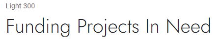
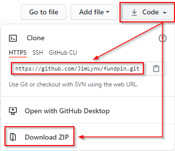

<div align="center">

<br>
SUPPORTING PROJECTS IN NEED
</div>

# Project Overview

Around the world there are groups and individuals who work tirelessly and selflessly towards supporting impoverished communities, protecting natural wildlife and sustaining our environmental resources.

One of the main sources of income for these incredible endeavours has been from the International Volunteer platform, which grew rapidly in popularity in the mid-90's. Volunteer Organisations offered a structured way for people to travel to far-out destinations for a set fee, which enabled the orginations to thrive and grow. The knock-on effect was that these organisations were able to assist more projects as they grew by provinding funding to them for each volunteer they send. The immense benefit to the projects was not only in the form of financial support, but provided physical presence of volunteers to assist with various tasks, which the projects could otherwise not afford to hire staff for.

The onset of the COVID crisis in early 2020 brought international travel to an abrupt halt, and as a result, a huge majority of Volunteer Organisations stopped operating. This, of course, meant that the projects' main source of income ceased almost immediately and significantly impeded the projects' ability to run effectively.

FundPIN (Fund Projects In Need) is dedicated to networking, supporting, and raising funds for non-profit organisations worldwide by providing an online platform, whereby users can find projects they are interested in supporting, donate to them directly through the site, and get updates on the progression and status of each.

---


[Live Site](https://fundpin.herokuapp.com/)

**Please note**: To open any links in this document in a new browser tab, please press `CTRL + Click`.

---

# Table of Contents

**<details><summary>[User Experience (UX)](#user-experience-ux)</summary>**

- [User Stories](#user-stories)
- [Strategy](#strategy)
- [Scope](#scope)
  - [Existing Features](#existing-features)
  - [Future Features to Implement](#future-features-to-implement)
- [Structure](#structure)
- [Database](#database)
- [Data Schema](#data-schema)
- [Skeleton](#skeleton)
- [Wireframes](#wireframes)
- [Surface](#surface)
  - [Colours](#colours)
  - [Typography](#typography)
  - [Animations](#animations)

</details>

**<details><summary>[Technologies Used](#technologies-used)</summary>**

- [Languages](#languages)
- [Integration](#integration)
- [Dependencies](#dependencies)
- [Tools](#tools)
- [IDE Extensions](#ide-extensions)
- [Code Validity](#code-validity)

</details>

**<details><summary>[Bugs/Issues](#bugs)</summary>**

- [Project barriers and solutions](#project-barriers-and-solutions)
- [Known Issues](#known-issues)

</details>

**<details><summary>[Workflow](#workflow)</summary>**

- [Version Control](#version-control)
- [Development Environment](#development-environment)

</details>

**<details><summary>[Deployment](#deployment)</summary>**
</details>

**<details><summary>[Testing](#testing)</summary>**
</details>

**<details><summary>[Credits](#credits)</summary>**

- [Resources](#resources)
- [Media](#media)
- [Content](#content)
- [Code Snippets](#code-snippets)
- [Acknowledgments](#acknowledgments)

</details>

**<details><summary>[Support](#support)</summary>**
</details>

---

## User Experience (UX)

### User Stories

|      As a/an...      |                         I want the ability to...                         |                        So that I can...                       |
|:--------------------:|:------------------------------------------------------------------------:|:-------------------------------------------------------------:|
|                      |                                                                          |                                                               |
|          ---         |                                    ---                                   |                              ---                              |
| Anonymous user       | easily navigate the site;                                                | find what I am looking for quickly                            |
| Anonymous user       | view the site on all screen sizes;                                       | visit the site using my mobile and/or tablet device           |
| Anonymous user       | read about the company details, goals and aims;                          | gain confidence that I am supporting a viable endeavour       |
| Anonymous user       | search for projects;                                                     | quickly browse which projects are available to support        |
| Anonymous user       | filter my search results;                                                | search by country and/or project type                         |
| Anonymous user       | read details about projects;                                             | understand the history, details and needs of the project      |
| Anonymous user       | read details of what percentage of donations FundPIN retains             | feel confident, knowing where my donation will end up         |
| Anonymous user       | access contact details;                                                  | get in touch with any questions                               |
| Anonymous user       | access social media of the company;                                      | join social media forums for news and updates                 |
| Anonymous user       | register for a user profile account by choosing a username and password; | store details of my saved projects and donation history       |
| Anonymous user       | register for a user profile account using my social media login details; | Allow a quick way to log in and create a profile              |
|          ---         |                                    ---                                   |                              ---                              |
| Registered user      | log in and log out of my profile account;                                | Safeguard my information whilst not active on the site        |
| Registered user      | update my details                                                        | update address and other details in case they change          |
| Registered user      | store my address for later use;                                          | avoid having to retype it every time I make a donation        |
| Registered user      | store my donation history;                                               | access my previous donation payments                          |
| Registered user      | enter a custom amount to donate to a particular project;                 | enter my own amount that I'd like to donate                   |
| Registered user      | select an amount from a drop-down list;                                  | quickly make a donation from pre-defined choices              |
| Registered user      | review my donation choices at checkout;                                  | decide whether to add or edit donations before confirming     |
| Registered user      | store my choices in checkout;                                            | go back to the site in case I wish to add more options        |
| Registered user      | Make secure payments                                                     | ensure my payments are securely handled                       |
| Registered user      | Receive email confirmation of my donation payment                        | confirm that my payment was made and keep track of accounting |
|          ---         |                                    ---                                   |                              ---                              |
| Site admin/superuser | add new projects and category listings;                                  | continuously make new projects available for support          |
| Site admin/superuser | update project listings;                                                 | update new info from projects                                 |
| Site admin/superuser | delete existing project listings;                                        | delete projects that may cease to exist                       |
| Site admin/superuser | create blogs;                                                            | inform users on project developments                          |
| Site admin/superuser | update blog entries;                                                     | update users on new project developments                      |
| Site admin/superuser | delete blog entries;                                                     | remove blog details in case they become irrelevant            |
|                      |                                                                          |                                                               |

### Strategy

With 18 years’ experience working with International NGO and non-profit organisations, I’ve gained a large perspective on the needs of these projects and the growing number of people that want to support them.

The target demographic is vast, and attracts all ‘earning’ ages from 18-. The highest region-specific interest groups mainly from Western cultures, including the UK & Europe, US & Canada, Australia and New Zealand.

The site should be easy to use for the older generations, yet captivating and fresh for the younger generations. A current visual approach is implemented to demand attention and relatability in line with modern websites and progress away from the traditionally ‘stuffy’ donation-type sites.

From experience, people are yearning to help and assist, and want to get actively involved, however also need to feel confident that the support that they are providing is going to the correct source. Majority of 'donation' type sites are very general on their approach to fundraising, and users never really know exactly where their donation has ended up.

FundPIN provides factual information regarding the amount donated, the amount that reaches the project itself and the amount that FundPIN retains as a small percentage to enable the project to be sustainable.

The main strategy of this site to provide accurate information about projects, make it easy and intuitive to navigate and transparent with information to maintain trust and integrity with users.

#### Project Goals

Increased visibility to the general public on the plight of NGO's operating in today's uncertain climate, and endeavouring to support and raise funds for them.

#### User Goals

Users can find projects in their relevant interest field, read details on the projects and choose which they wish to donate to.

### Scope

Fits in with my current skill-set of HTML, CSS, JavaScript, Python and Django.

Provide MVP with relevant categories, project listings and detail pages, with plenty of room for expansion

#### Existing Features

- Fully responsive website across all popular devices, using Bootstrap Grid and custom media queries.
- Vivid and emotive images in interative carousels to elicit a positive response.
- Intuitive and responsive Navigation menu.
- About section on Home page to read company details and donation policies.
- Search function with filtering.
- Project detail pages.
- Login page with form
- Login with Social Media options
- Profile/account page.
- Checkout page
- Footer element with quick links, social media icon links and company contact details.
- Newsletter Subscription link from footer.
- Project management page for adding, updating and deleting projects.
- Blog management page for adding, updating and deleting blog entries.
- Loyalty app to earn PINS in profiles

##### Stretch Goals

#### Future Features to Implement

- Project submissions form and functionality to enable potential NGO's to submit projects for review.
- Implement pre-population of slug field when adding a new blog post.
- Implement Lazyload, specifically on home page, to decrease load times.
- Implement Pagination on Project page.
- Facebook Login - see [Project barriers and solutions](#project-barriers-and-solutions) for more detials on why this is currently not implemented.
- Implement further communication to the user via email for order invoices & confirmation.
- Further development of Profile page to include profile image, pinned projects for future donations and additional fields/better constructed layout.

### Structure

The overall structure is aimed at ease of navigation to each section and provides progressive disclosure on each page, hinting for further reading and thus drawing the user in to remain engaged.

#### Interaction Design

The content has been laid out in an intuiitive way, providing a good flow of information, with the main landing page diving clear direction to browsing the projects on the projects page.

Clear feedback is provided to the user after each interaction, using the messages function in Django (success, info and error, providing the user with clear direction)

#### Information Architecture

TBA =========> navigational SCHEMA.   

The main organising principle for the user is the type of project, yet the Country that the project is based in is an important factor so this has been incorporated as a top-level category in the search ability.

- Search by Keyword
- Search by Project Type
- Search by Country

#### Database

[SQLite3](https://www.sqlite.org/index.html) used in Development, which comes as default with Django installation.
[Heroku Postgres](https://www.heroku.com/postgres) used in Production as site is deployed on [Heroku](https://www.heroku.com/)

#### Apps and Models used

- Projects App

  - The **Project model** stores information about the projects.

  - The **Country model** stores information about the countries and is used in the Project model as a specific category.

  - The **Category model** stores information about the categories and is used in the Project model as a specific category.

- Profiles App

  - The **UserProfile** model stores information about registered users, including donation order history.

- Checkout App

  - The **Order** model stores information about each donation order placed.

  - The **OrderLineItem** model stores information from the order, used in calculation in the Order model.

- Blog App

  - The **Post** model stores information about the Blog post.

  - The **Comments** model stores information used in the Comment Form, using Django's auth's **User** model as a Foreign Key to allow only Registered users to post comments.

#### Model Relationship Data Schema

I've used [DBDiagram](https://dbdiagram.io/) to draw up a Database Schema, which shows the relationships between the models.


### Skeleton

#### Page Structure


#### Wireframes

[BASE TEMPLATE](docs/wireframes/base-template.pdf) - Detail for Navigation and Footer for **all** site pages.

##### Anonymous Users

- [HOME Page](docs/wireframes/home-wireframe.pdf)
- [PROJECTS Page](docs/wireframes/project-list-wireframe.pdf)
- [PROJECT DETAILS Page](docs/wireframes/project-detail-wireframe.pdf)
- [REGISTER Page](docs/wireframes/register-wireframe.pdf)
- [LOGIN Page](docs/wireframes/login-wireframe.pdf)
- [BLOG Page](docs/wireframes/blog-list-wireframe.pdf)
- [BLOG DETAILS Page](docs/wireframes/blog-detail-wireframe.pdf)
- [CONTACT Page](docs/wireframes/contact-wireframe.pdf)

##### Registered Users (including all above)

- [PROFILE Page](docs/wireframes/profile-wireframe.pdf)
- [DONATION CART Page](docs/wireframes/cart-wireframe.pdf)
- [DONATION CONFIRMATION Page](docs/wireframes/donation-confirmation-wireframe.pdf)

##### SuperUser (including all above)

- [ADD PROJECT Page](docs/wireframes/add-project-wireframe.pdf)
- [EDIT PROJECT Page](docs/wireframes/edit-project-wireframe.pdf)
- [ADD BLOG Page](docs/wireframes/add-blog-wireframe.pdf)
- [EDIT BLOG Page](docs/wireframes/edit-blog-wireframe.pdf)

The layout has been kept consistent throughout site by visually grouping elements in order of importance.

- Top Navigation bar - Menu with links pointing to each page, inluding:
  - Searching via keywords/phrases
  - Searching by Country filter
  - Searching by Project Type filter  
  - Pagination

- Navigation convention has been incorporated to give the user a sense of familiarity and avoid confusion.
- Navigation elements are visible and easily findable.
- Progressive disclosure in the form of progress pagination has been incorporated throughout, with the use of carousels, indicating providing the user with information of where they are in that section at any given point.
- Cognitive icons have been used consistently to communicate navigation to keep it simple for the user.
- Footer with social media links, quick links for additional information and contact details

### Surface

The overall UX needs to align with the aesthetics of a Donation type site, yet with a more modern approach to avoid it being too generic. The overall feel needs to exude professionalism, giving confidence to users that they are donating to a trustworthy source. A large focal point is on providing vivid imagery and easy to read text o keep the user engaged.

#### Colours

Colour palette has been chosen to align with a fresher look to the generic charity/fundraising/NGO sites out there.

Colour Palette generated on [Coolors.co](https://coolors.co/44444e-b71234-d55c19-00675a-53284f-55601c-006983)


#### Typography

- Headings - "Quicksand" font (with fall-back font of Serif). This font was chosen for its environmental feel with slightly rounded features, alternating between font-weights from 500 & 700 for visual impact.


- Content - "Jost" font (with fall-back font of Sans-Serif), clean and balances well with the Headings. A consistent font-weight of 300 Light and Normal has been used throughout.



#### Images

Imagery for this project is vital and I've selected media that captures attention and gives the user an immediate association with the project, before reading deails on it.

README icons are hosted on [Cloudinary](https://cloudinary.com/), a cloud-based service that provides an end-to-end image and video management solutions.

#### Animations

To ensure the site is uncluttered, a minimalistic approach has been taken in terms of animation. The carousels have been given a delay for soft transitions, navigation with smooth scroll effect and buttons have very subtle hover and click effects.

> [Back to Top](#table-of-contents)  

## Technologies Used

Designed with HTML5, CSS3, JavaScript, Python3 with the Django Framework

### Languages

 [HTML5](https://en.wikipedia.org/wiki/HTML5)

 [CSS3](https://en.wikipedia.org/wiki/Cascading_Style_Sheets)

 [JavaScript](https://en.wikipedia.org/wiki/JavaScript)

 [Python](https://en.wikipedia.org/wiki/Python_(programming_language))

### Integration

 [Bootstrap](https://getbootstrap.com/) - by linking via [Bootstrap CDN](https://www.bootstrapcdn.com/) to HTML Doc

 [FontAwesome](https://fontawesome.com/) Icons for Social Media links

 [Google Fonts](https://fonts.google.com/) - Overall Typography import

 [jQuery](https://jquery.com/) - JavaScript library

 [Django](----------------------) Micro web framework written in Python

### Dependencies

- [Autopep8](https://pypi.org/project/autopep8/) Python Code formatter
- [MarkupSafe](https://pypi.org/project/MarkupSafe/) Implements a text object that escapes characters so it is safe to use in HTML and XML

### Tools

 [VSCode](https://code.visualstudio.com/) - Main workspace IDE (Integrated Development Environment)

 [Git](https://git-scm.com/) - Distributed Version Control tool to store versions of files and track changes

 [GitHub](https://github.com/) - A cloud-based hosting service to manage Git repositories

 [Heroku](https://heroku.com) - Container-based cloud platform for deployment and running of apps

 [AWS S3](https://aws.amazon.com/s3/) - Cloud storage for static and media files

### IDE Extensions

- Auto Close Tag
- Bracket Pair Colorizer
- Beautify - Code Formatter
- Indent-Rainbow
- Bootstrap 4 CDN Snippet
- Markdown Lint
- Python
- JSHint

### Code Validity

- HTML - [W3C](https://validator.w3.org/) - Markup Validation
- CSS - [W3C](https://jigsaw.w3.org/css-validator/) - Jigsaw CSS Validation
- JavaScript - [JSHINT](https://jshint.com/) - JavaScript code warning & error check
- Python - [Pyton Tester](https://extendsclass.com/python-tester.html) Python code syntax checker
- [Autoprefixer](https://autoprefixer.github.io/) Parses CSS and adds vendor prefixes.
- [Google Mobile-Friendly Test](https://search.google.com/test/mobile-friendly) Mobile-friendly check on site.
- [Website Page Test](https://www.webpagetest.org/) Runs a website speed test from multiple locations around the globe using real browsers (IE and Chrome) and at real consumer connection speeds.
- [Online-Spellcheck](https://www.online-spellcheck.com/) Online spelling and grammar checks for site and README content.

### Other

- [Favicon](https://favicon.io/favicon-converter/) - Favicon Generator
- [Adobe Photoshop CS6](https://www.adobe.com/ie/products/photoshop.html) - Image manipulation and colour corrections
- [Swiper JS](https://swiperjs.com/) for image carousels
- [PDF Tools](https://tools.pdf24.org/en/) for wireframe PDF compression

> [Back to Top](#table-of-contents)  

## Bugs

### Project barriers and solutions

- On setting the RichText editor for the project descriptions to 'justify text', this was applying an inline style to the rendered paragraph text from the database, which meant that the paragraphs could not be text-aligned with with css. Overcame this by leaving all paragraph text as default and custom to allow ability to align from custom css styling.
- Toasts were not showing up from django-allauth, but fine on the site for custom alerts. Created branch *allauth-toasts* to try and resolve this issue. Narrowed this down to the jQuery show/hide not being called for defauly django toasts. Resolved by adding the toasts show/hide jQuery script to the index.html postloadjs block as this was being overwritten by the swiper carousel and custom script.
- Although a users billing details are saved correctly on the profile, and update as expected, the checkout form is not pre-populating the saved info. Resolved after finding that this was a minor issue anad I'd duplicated the order_form variable in checkout views.py, which was clearing the form after save.
- The Facebook Login functionality has been working, but due to various emails from Facebook regarding requirements for GDPR, Privacy Policy and more, I have decided to omit the Facebook Login feature due these extra requirements being out of the scope of this project (as a 'for educational purposes' only site). Once the site is built for a real-world applciation, the Facebook funtionality can be reimplemented.
- Webhooks and signals not working as they should. Created branch *webhooks* to work on a resolve. => Resolved - Webhooks seem to be returning correct messages.

### Known Issues

- On user logout, cart data does not persist and session is cleared on logging back in. On further investigating, allowing the persistent data could cause security vulnerabilities so this has been excluded from this project.
- The Facebook 'Share' button returns the home url of the site, and not the specific project or blog page as intented. However, through the same package [django_social_share](https://pypi.org/project/django-social-share/), the Twitter and Email options return the correct results. I have tried many fixes to this, yet have not found a resolve and have decided to leave this as an existing issue to be resolved in further development after submission.
- During HTML validation, recieved: "**Error**: Duplicate attribute id." => **Unresolved**: `id="id_image"` is generated in the same input as `id="new-image"`, presumably by the JavaScript. As this is working fine, I've decided to leave this as a future bug fix for now due to time-constraints.
- During HTML validation, recieved: "**Error**: Duplicate ID in remove_(itemid)" => **Unresolved**: Unable to find cause, but presumed to be from the `update_remove_donation.html`template. As this is working fine, I've decided to leave this as a future bug fix for now due to time-constraints.
- Email confirmation of purchase order is not going through after checkout success. Webhooks see, to be working and unsure why the email is not sending. Due to time-constraints, this issue will be resolved at a later date after project submission.
- If keyword is entered in the Search bar, it returns all words that that keyword is part of - i.e if entering a search for 'lion' then the word 'bil**lion**' is returned.

> [Back to Top](#table-of-contents)  

## Workflow

### Version Control

- Used Git for version control.
- Various branches were created for features.
- The branches were then merged with the main branch once any conflicts were resolved.

### Development Environment

- All code was written on [Visual Studio Code](https://code.visualstudio.com/), a local IDE (Integrated Development Environment).
- A virtual environment was created on VSCode to ensure that the packages installed are only installed in the virtual environment folder.
- The code was then pushed to GitHub where it is stored in my [Repository](https://github.com/JimLynx/fundpin).

> [Back to Top](#table-of-contents)  

### Local Installation

#### 1. Clone the project

- The code can be run locally through clone or download from the repository on [GitHub](https://github.com/JimLynx/fundpin).
- You can do this by opening the repository, clicking on the Code' button and selecting either 'clone or download'.

    
- The Clone option provides a URL, which you can use on your CLI with `git clone <paste url>`.
- The Download ZIP option provides a link to download a ZIP file which can be unzipped on your local machine. The files can then be uploaded to your IDE.

#### 2. Create a Virtual Environment

In the Terminal window:

- Navigate to the folder of the installed files with `cd <path>`
- Create the virtual environment folder with `python -m venv venv`
- Activate the virtual environment with `venv\Scripts\activate.bat`

*Note: The above commands were used on Visual Studio Code on Windows. For other IDE's and Linux, please refer to [Creation of Virtual Environments](https://docs.python.org/3/library/venv.html)*

#### 3. Create Environmental Variables

- For sensitive information/passwords, create an `env.py` file to store these as environmental variables.

```python
import os

os.environ['DEVELOPMENT'] = 'True'

# Django Secret key - ensure you remove it 
# from main>settings.py before pushing to your repository
os.environ['SECRET_KEY'] = '<your value>'

# stripe
os.environ['STRIPE_PUBLIC_KEY'] ='<your value>'
os.environ['STRIPE_SECRET_KEY'] ='<your value>'
os.environ['STRIPE_WH_SECRET'] = '<your value>'

# DB
os.environ['DATABASE_URL'] ='<your value>'

# AWS S3
os.environ['AWS_ACCESS_KEY_ID'] = '<your value>'
os.environ['AWS_SECRET_ACCESS_KEY'] = '<your value>'

# Email
os.environ['DEFAULT_FROM_EMAIL'] = '<your value>'
os.environ['EMAIL_HOST_USER'] = '<your value>'
os.environ['EMAIL_HOST_PASSWORD'] = '<your value>'

# Leaflet maps
os.environ['LEAFLET_API_KEY'] = '<your value>'

```

This file is added to the `.gitignore` file detailed below.

#### 4. Create a .gitignore file

- Create a file called `.gitignore` in the root directory and ensure it contains the following git exclusions:

```text
    core.Microsoft*
    core.mongo*
    core.python*
    env.py
    __pycache__/
    *.py[cod]
    venv
    .vscode
    *.sqlite3
    *.pyc
```

#### 5. Install project dependencies

- Install project requirements by typing `pip install -r requirements.txt`

#### 6. Migrate

- Apply model migrations using `python manage.py migrate`

#### 7. Create a SuperUser account

- Type `python manage.py createsuperuser` and following the username and passwords prompts from the terminal.

#### 8. Deploy locally

- To run the project locally, in the terminal type `python manage.py runserver`
- This will open a localhost address, which is provided in the CLI.
- Either copy and paste the url (provided in the terminal) into a new browser tab, or hover over it and click *follow link*

## Deployment

This project has been deployed to [HEROKU](https://www.heroku.com/)

Media files are hosted on AWS S3 Bucket, and instructions can be found [HERE](https://docs.aws.amazon.com/AmazonS3/latest/userguide/GetStartedWithS3.html)

### Deployment Instructions

1. [Sign up](https://signup.heroku.com/login) for an account on Heroku or [Log in](https://id.heroku.com/login) with your existing account.

2. Click on the 'New' dropdown box and 'Create new app'


3. Name your app, choose the appropriate region and submit.


4. On the Resources tab, search for Heroku Postgres Database and add (*a free Hoby Dev account can be used*).

5. Postgres requires dj_database_url, and psycopg2, which will be installed when the requirements.txt dependencies are installed as explained earlier.

6. Click on the Deploy tab and select the GitHub option, then choose you GitHub account and saeerch for the repository to connect to (*You can enter a keyword in the input to search for*). Once confirmed, press 'Connect'.


7. Under Manual deploy, choose your main (or sometime called master) branch to deploy to and press 'Deploy Branch'


8. Once the build has completed, under Automatic deploys, choose your main (or sometime called master) branch and press 'Enable Automatic Deploys'


9. Click on the Settings tab and then the 'Reveal Config Vars' button to reveal the Environmental Variables


10. Enter your Environmental variables and values with the following fields:


> [Back to Top](#table-of-contents)  

## Testing

Testing documentation can be found on a separate document [HERE](docs/TESTING.md)

## Credits

### Resources

- [Code Institute Course Content](https://courses.codeinstitute.net/) - Main source of fundamental knowledge, particularly the Boutique Ado mini-project.
- Code Institute **SLACK Community** - Main source of assistance
- [Stack Overflow](https://stackoverflow.com/) - General resource.
- [Youtube](https://www.youtube.com/) - General resource.
- [CSS-Tricks](https://css-tricks.com/) - General resource.
- [W3.CSS](https://www.w3schools.com/w3css/4/w3.css) - General resource.
- [CommonMark](https://commonmark.org/help/) - For Markdown language reference.
- [Colour Palette - Coolors.co](https://coolors.co)
- [TinyPNG](https://tinypng.com/) - Efficient compression of images for site.
- [Am I Responsive](http://ami.responsivedesign.is/) - Responsive website mockup image generator.
- [Balsamiq](https://balsamiq.com/wireframes/) - Wireframing design tool.

### Media

- Site images used are from various contributors on [Unsplash](https://unsplash.com/), and online source of freely-usable images.
- Site logo designed using [Hatchful Shopify](https://hatchful.shopify.com/), a free online logo maker.
- Hamburger mobile-menu icon png taken from [Hiclipart](https://www.hiclipart.com/) and edited in Photoshop for site colour match.
- Icons used in the Technologies Used section of this document are taken from various sources (mainly Wikipeadia).
- Home page lead-in icons downloaded as svg from [Material Icons](https://material.io/resources/icons/)

### Content

All content is self-written by site creator.

### Code Snippets

- CSS Radial gradient for instagram colours from [CodePen by Thomas Rye](https://codepen.io/thomasrye/pen/VaRoYv)
- Inspiration for Navbar mobile side menu from [W3Schools](https://www.w3schools.com/howto/howto_js_sidenav.asp)
- CSS for hiding scrollbars on all browsers from [W3Schools](https://www.w3schools.com/howto/howto_css_hide_scrollbars.asp)
- Project cards, on Projects page, customized from Codepen by [Tenzing Gaychey](https://codepen.io/tgaychey/pen/PROMVy)
- Checkout payment overlay animation customised from [Codepen](https://codepen.io/yumeeeei/pen/BQPmpX) by [@yumeeeei](https://codepen.io/yumeeeei)
- Google Login button from [Stack Overflow](https://stackoverflow.com/a/59119994)

## Acknowledgments

I would like to thank:

- My mentor, **Aaron Sinnott** for his guidance and advice.
- **[Tim Nelson](https://github.com/TravelTimN)**, **[Bim Williams](https://github.com/mrbim)**, **[John Traas](https://github.com/Jays-T)**, **[Anthony O'Brien](https://github.com/auxfuse)**, **[Daisy Mc Girr](https://github.com/Daisy-McG)** and **[Sean Murphy](https://github.com/nazarja)** for always being open to discussing, helping and generally being awesome people.
- Help with JS storing CTA banner in local storage after close [Sean Murphy](https://github.com/nazarja)
- Assistance from [Sean Murphy](https://github.com/nazarja) and [John Traas](https://github.com/Jays-T), for helping me to refactor my JavaScript to get a total from inputs on the donation form.
- Everyone in Tutor support for always being patient and friendly when approaching with assistance during course material.
- **CI staff** and **Slack Community** for always being on-hand with questions posted and assistance requests.
- Everyone that takes part in the Slack calls, specifically from the **#In-It-Together** and **#Study-Group** channels.

## Support

For any issue resolution or assistance, please email :e-mail: [Jim Morel](jim.lynx@gmail.com) :e-mail:

> [Back to Top](#table-of-contents)  
