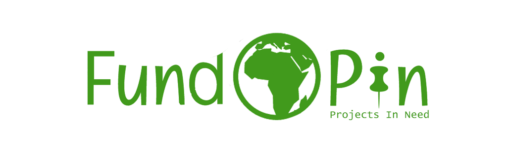

# FundPIN

<div align="center">

</div>


## Table of Contents

> - [Overview](#overview)
> - [User Stories](#user-stories)
> - [UX](#ux)
> - [Features](#features)
> - [Technologies Used](#technologies-used)
> - [References for learning](#references-for-learning)
> - [Testing](#testing)
> - [Project barriers and solutions](#project-barriers-and-solutions)
> - [Known Issues](#known-issues)
> - [Code validity](#code-validity)
> - [Version Control](#version-control)
> - [Deployment](#deployment)
> - [Credits](#credits)
> - [Acknowledgments](#acknowledgments)
> - [Support](#support)

Site deployed on Heroku [HERE](https://channel-lead-resources.herokuapp.com/)

**Please note: To open any links in this document in a new browser tab, please press `CTRL + Click`.**

## Overview

Around the world, there are incredible endevours, which work tirelessly and selflessly towards supporting imporverished communities, protecting natural wildlife and sustaining environmental resources.

One of the main sources of income for these projects has been from the International Volunteer platform, which grew rapidly in popularity in the mid-90's. Volunteer Organisations offered a structured way for people to travel to far-out destinations for a set fee, which enabled the orginations to thrive and grow. The knock-on effect was that these organisations were able to assist more projects as they grew by provinding funding to them for each volunteer they send. The immense benefit to the projects was not only in the form of fnancial support, but provided physical presence of volunteers to assist with various tasks, which the projects could otherwise not afford to hire staff for.

The onset of the COVID crisis in early 2020 brought international travel to an abrupt halt, and as a result, a huge majority of Volunteer Organisations stopped operating. This, of course, meant that the projects' main source of income ceased almost immediately and significantly impeded the projects' ability to run effectively.

FundPIN (Fund Projects In Need) is dedicated to networking, supporting, and raising funds for non-profit organisations worldwide by providing an online platform, whereby users can find projects they are interested in supporting, donate to them directly through the site, and get updates on the progression and status of each.

> [Back to Top](#table-of-contents)  

## User Stories

| Relevant Section |      As a/an...      |                         I want the ability to...                         |                      So that I can...                     |
|------------------|:--------------------:|:------------------------------------------------------------------------:|:---------------------------------------------------------:|
|                  |                      |                                                                          |                                                           |
|                  |          ---         |                                    ---                                   |                            ---                            |
|                  | Anonymous user       | easily navigate the site;                                                | find what I am looking for quickly                        |
|                  | Anonymous user       | view the site on all screen sizes;                                       | visit the site using my mobile and/or tablet device       |
|                  | Anonymous user       | read about the company details,goals and aims;                           | gain confidence that I am supporting a viable endeavour   |
|                  | Anonymous user       | search for projects;                                                     | quickly browse which projects are available to support    |
|                  | Anonymous user       | filter my search results;                                                | search by country and/or project type                     |
|                  | Anonymous user       | read details about projects;                                             | understand the history, details and needs of the project  |
|                  | Anonymous user       | read details of what percentage of donations the projects receive        | feel confident, knowing where my donation will end up     |
|                  | Anonymous user       | access contact details;                                                  | get in touch with any questions                           |
|                  | Anonymous user       | access social media of the company;                                      | join social media forums for news and updates             |
|                  | Anonymous user       | register for a user profile account by choosing a username and password; | store details of my saved projects and donation history   |
|                  | Anonymous user       | register for a user profile account using my social media login details; | store details of my saved projects and donation history   |
|                  |          ---         |                                    ---                                   |                            ---                            |
|                  | Registered user      | log in and log out of my profile account;                                | Safeguard my information whilst not active on the site    |
|                  | Registered user      | store my address for later use;                                          | avoid having to retype it every time I make a donation    |
|                  | Registered user      | store my donation history;                                               | access my previous donation payments                      |
|                  | Registered user      | enter a custom amount to donate to a particular project;                 | enter my own amount that I'd like to donate               |
|                  | Registered user      | select an amount from a drop-down list;                                  | quickly make a donation from pre-defined choices          |
|                  | Registered user      | review my donation choices at checkout;                                  | decide whether to add or edit donations before confirming |
|                  | Registered user      | store my choices in checkout;                                            | go back to the site in case I wish to add more options    |
|                  |          ---         |                                    ---                                   |                            ---                            |
|                  | Site admin/superuser | add new projects and category listings;                                  | continuously make new projects available for support      |
|                  | Site admin/superuser | update project listings;                                                 | update new info from projects                             |
|                  | Site admin/superuser | delete existing project listings;                                        | delete projects that may cease to exist                   |
|                  | Site admin/superuser | create blogs;                                                            | inform users on project developments                      |
|                  | Site admin/superuser | update blog entries;                                                     | update users on new project developments                  |
|                  | Site admin/superuser | delete blog entries;                                                     | remove blog details in case they become irrelevant        |
|                  |                      |                                                                          |                                                           |

> [Back to Top](#table-of-contents)  

## UX

This website project

### 1. Strategy

The audience target demographic is all-encompassing in terms of cultures and ages, so the prime strategy is to keep the site easy to use, yet fresh, uplifting and current. From experience, people do want to get involved and need to feel confident that the support that they are providing is going to the correct source. Supporters who donate are provided with factual information regarding the amount donated, the amount that reaches the project itself and the amount that FundPIN retains as a small percentage to enable the project to be sustainable. This detailed information is excluded from majority 'donation' type sites, so users never really know where their donation has ended up.

#### Project and User Goals

### 2. Scope

- Fits in with my current skill-set of HTML, CSS, JavaScript, Python and Django

### 3. Structure

The overall structure is for ease of navigation to each section

### 4. Skeleton

- Navigation bar - Menu with links pointing to each page.

- Footer

### 5. Surface

The overall UX

#### Colours

Colour palette has been chosen to align with ------------------

[Colour Palette - Coolors.co](----------------)


#### Typography

-

#### Images

-

#### Design Choices

-

> [Back to Top](#table-of-contents)  

## Features

### Existing Features

- Designed with HTML5, CSS3, JavaScript, Python3 with the Django Framework

### Features Left to Implement

-

> [Back to Top](#table-of-contents)  

## Technologies Used

### 1. Languages

 [HTML5](https://en.wikipedia.org/wiki/HTML5)

 [CSS3](https://en.wikipedia.org/wiki/Cascading_Style_Sheets)

 [JavaScript](https://en.wikipedia.org/wiki/JavaScript)

 [Python](https://en.wikipedia.org/wiki/Python_(programming_language))

### 2. Integration

 [Bootstrap](https://getbootstrap.com/) - by linking via [Bootstrap CDN](https://www.bootstrapcdn.com/) to HTML Doc

 [FontAwesome](https://fontawesome.com/) Icons for Social Media links

 [Google Fonts](https://fonts.google.com/) - Overall Typography import

 [jQuery](https://jquery.com/) - JavaScript library

 [Django](----------------------) Micro web framework written in Python


### 3. Dependencies

- [autopep8](https://pypi.org/project/autopep8/) Python Code formatter
- [MarkupSafe](https://pypi.org/project/MarkupSafe/) Implements a text object that escapes characters so it is safe to use in HTML and XML

### 4. Workspace, Version Control, Repository storage and Deployment

 [VSCode](https://code.visualstudio.com/) - Main workspace IDE (Integrated Development Environment)

 [Git](https://git-scm.com/) - Distributed Version Control tool to store versions of files and track changes

 [GitHub](https://github.com/) - A cloud-based hosting service to manage Git repositories

 [Heroku](https://heroku.com) - Container-based cloud platform for deployment and running of apps

### 5. Other

- [Autoprefixer](https://autoprefixer.github.io/) Parses CSS and adds vendor prefixes.
- [Google Mobile-Friendly Test](https://search.google.com/test/mobile-friendly) Mobile-friendly check on site.
- [Website Page Test](https://www.webpagetest.org/) Runs a website speed test from multiple locations around the globe using real browsers (IE and Chrome) and at real consumer connection speeds.
- [Online-Spellcheck](https://www.online-spellcheck.com/) Online spelling and grammar checks.

### 6. IDE Extensions used in VSCode

- Auto Close Tag
- Auto Rename Nametag
- Bracket Pair Colorizer
- Code Spellchecker
- Beautify - Code Formatter
- Indent-Rainbow
- Bootstrap 4 CDN Snippet
- Markdown Lint
- Python
- JSHint

> [Back to Top](#table-of-contents)  

## Resources

- [Code Institute Course Content](https://courses.codeinstitute.net/) - Main source of fundamental knowledge.
- Code Institute **SLACK Community** - Main source of assistance
- [Stack Overflow](https://stackoverflow.com/) - General resource.
- [Youtube](https://www.youtube.com/) - General resource.
- [CSS-Tricks](https://css-tricks.com/) - General resource.
- [W3.CSS](https://www.w3schools.com/w3css/4/w3.css) - General resource.
- [CommonMark](https://commonmark.org/help/) - For Markdown language reference.
- [Colour Palette - Coolors.co](https://coolors.co)
- [TinyPNG](https://tinypng.com/) - Efficient compression of images for site.
- [Am I Responsive](http://ami.responsivedesign.is/) - Responsive website mockup image generator.
- [Balsamiq](https://balsamiq.com/wireframes/) - Wireframing design tool.

> [Back to Top](#table-of-contents)  

## Testing

Testing documentation can be found on a separate document [HERE](static/testing/TESTING.md)

## Project barriers and solutions

-

> [Back to Top](#table-of-contents)  

## Known Issues

-

> [Back to Top](#table-of-contents)  

## Code validity

- HTML - [W3C](https://validator.w3.org/) - Markup Validation
- CSS - [W3C](https://jigsaw.w3.org/css-validator/) - Jigsaw CSS Validation
- JavaScript - [JSHINT](https://jshint.com/) - JavaScript code warning & error check
- Python - [Pyton Tester](https://extendsclass.com/python-tester.html) Python code syntax checker
- TAGS - [Closing Tag Checker for HTML5](https://www.aliciaramirez.com/closing-tags-checker/) - Validates all tags are opening and closing correctly.

## Version Control

- Used Git for version control.
- User-confirmation branch for implementing and testing confirmation modal dialogues.
- The branch was then merged with the main branch after any conflicts were addressed.

### IDE

- All code was written on [Visual Studio Code](https://code.visualstudio.com/), a local IDE (Integrated Development Environment).
- A virtual environment was created on VSCode to ensure that the packages installed are only installed in the virtual environment folder.
- The code was then pushed to GitHub where it is stored in my [Repository](https://github.com/JimLynx/givetu).

> [Back to Top](#table-of-contents)  

## Deployment

### Local Installation

#### 1. Cloning the project

- The code can be run locally through clone or download from the repository on [GitHub](https://github.com/JimLynx/givetu).
- You can do this by opening the repository, clicking on the Code' button and selecting either 'clone or download'.

    
- The Clone option provides a URL, which you can use on your CLI with `git clone <paste url>`.
- The Download ZIP option provides a link to download a ZIP file which can be unzipped on your local machine. The files can then be uploaded to your IDE.

#### 2. Create a Virtual Environment

In the Terminal window:

- Navigate to the folder of the installed files with `cd <path>`
- Create the virtual environment folder with `python -m venv venv`
- Activate the virtual environment with `venv\Scripts\activate.bat`

*Note: The above commands were used on Visual Studio Code on Windows. For other IDE's and Linux, please refer to [Creation of Virtual Environments](https://docs.python.org/3/library/venv.html)*

#### 3. Create Environmental Variables

#### 4. Create a .gitignore file

- Create a file called **.gitignore** in the root directory and ensure it contains the following git exclusions:

```text
    core.Microsoft*
    core.mongo*
    core.python*
    env.py
    __pycache__/
    *.py[cod]
    venv
    .vscode
    *.sqlite3
    *.pyc
```

#### 5. Install project dependencies

- Install project requirements by typing `pip install -r requirements.txt`

#### 6. --------------

-


#### 7. Deploy locally

- To run the project locally, in the terminal type `python manage.py runserver`
- This will open a localhost address, which is provided in the CLI.
- Either copy and paste the url shown below into a new browser tab, or hover over it and click *follow link*

#### 8. Remote Deployment on Heroku

> [Back to Top](#table-of-contents)  

## Credits

### Media

#### Content

#### Bootstrap 4 CDN Boilerplate

- I've taken advantage of _Simen Daehlin's_ HTML template boilerplate from his [Marketplace](https://marketplace.visualstudio.com/items?itemName=eventyret.bootstrap-4-cdn-snippet)

#### Code Snippets

## Acknowledgments

I would like to thank:

- My mentor, **Aaron Sinnott** for his guidance and advice.
- **[Tim Nelson](https://github.com/TravelTimN)**, **[Bim Williams](https://github.com/mrbim)**, **[John Traas](https://github.com/Jays-T)**, **[Anthony O'Brien](https://github.com/auxfuse)** and **[Sean Murphy](https://github.com/nazarja)** for always being open to discussing, helping and generally being awesome people.
- Everyone in Tutor support for always being patient and friendly when approaching with assistance during course material.
- **CI staff** and **Slack Community** for always being on-hand with questions posted and assistance requests.
- Everyone that takes part in the Slack calls, specifically from the **#In-It-Together** and **#Study-Group** channels.

## Support

For any issue resolution or assistance, please email  Jim Morel :e-mail: jim.lynx@gmail.com :e-mail:

> [Back to Top](#table-of-contents)  
